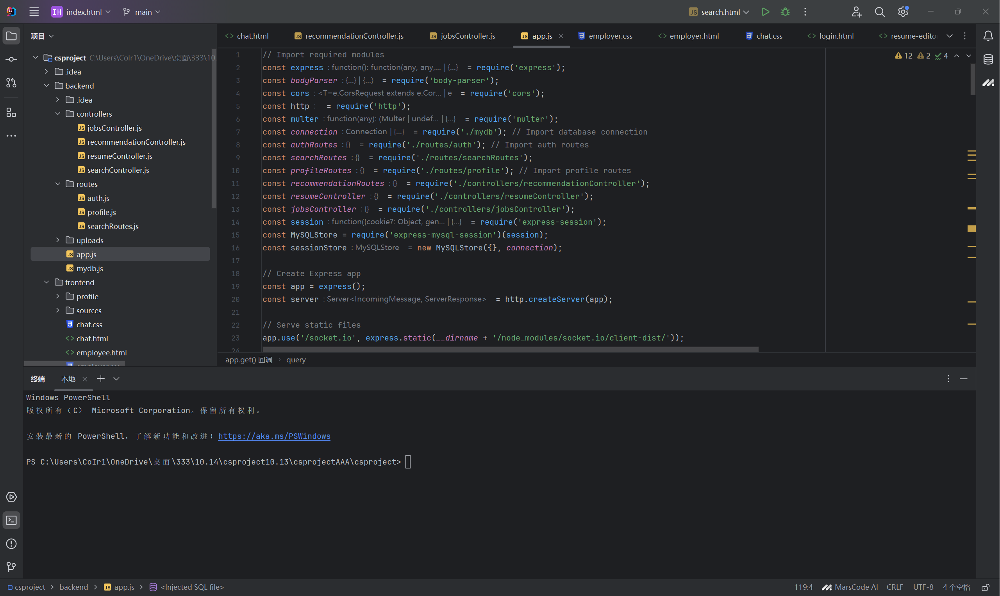
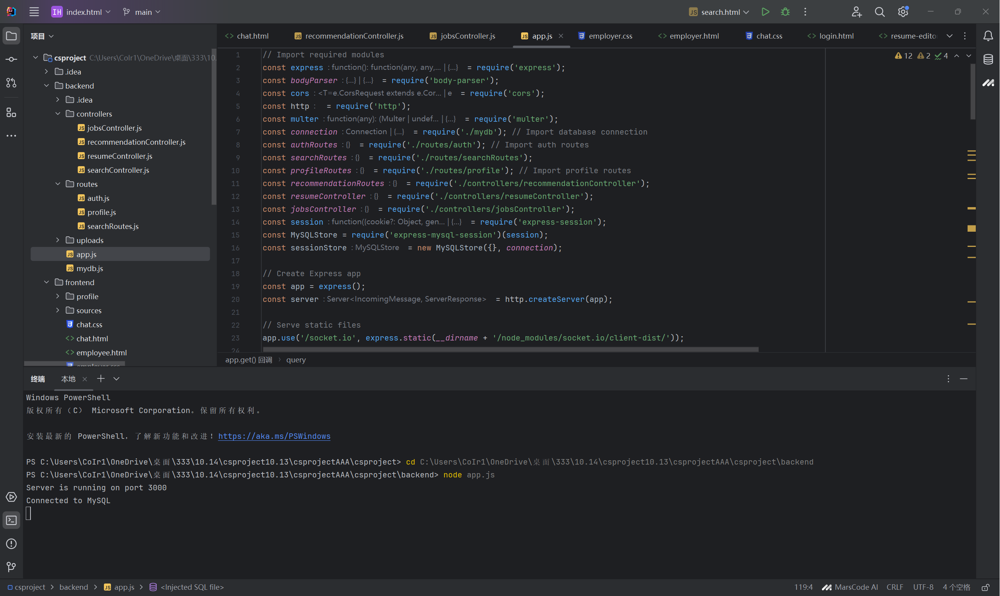
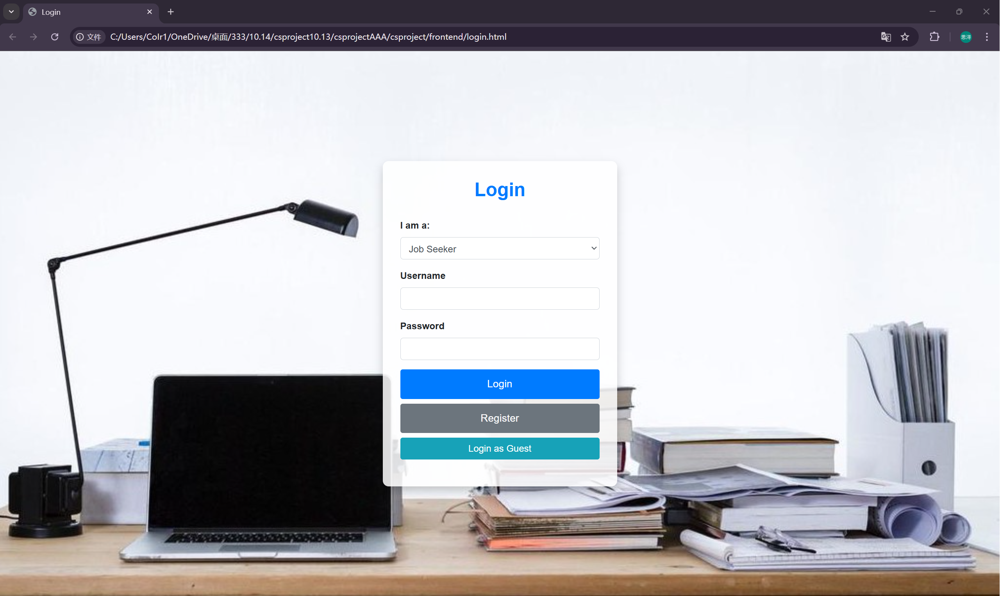

# Job Portal Application

**A recruitment platform based on Node.js and Express that helps job seekers find suitable positions while providing employers with convenient job management and communication tools. The platform supports functions such as user registration, job search, resume management, job recommendation, and real-time chat.**

## Table of Contents
1. [Project Introduction](#project-introduction)
2. [Features](#features)
3. [Installation and Configuration](#installation-and-configuration)
4. [API Endpoints](#api-endpoints)
5. [Usage Example](#usage-example)
6. [Technology Stack](#technology-stack)
7. [Future Improvement Directions](#future-improvement-directions)

## Project Introduction
The Job Portal Application is an online recruitment platform mainly targeting job seekers and employers. Job seekers can browse and apply for jobs on the platform, create and manage personal resumes; employers can post jobs, screen and contact suitable candidates. The platform also supports real-time chat between users to improve the communication efficiency of job seeking and recruitment.

## Features
1. **User Registration and Login**: Users can register as "job seeker" or "employer" and log in to different homepages according to their identities.
2. **Job Search and Recommendation**: Job seekers can search for jobs by keywords, locations, industries, salaries, and other conditions. The system will also recommend jobs based on user preferences.
3. **Resume Management**: Job seekers can create, edit, and save resumes and submit resumes to apply for jobs.
4. **Chat Function**: Job seekers and employers can chat in real time through the platform for convenient communication.
5. **Job Collection**: Users can collect jobs they are interested in for later viewing.

## Installation and Configuration
1. **Environment Requirements**:
   - Node.js 14 or higher.
   - MySQL database.
2. **Clone the Project**:
   ```bash
   git clone https://github.com/ydkdx/159333.git
   cd job-portal
   ```
3. **Install Dependencies**:
   ```bash
   npm install
   ```
4. **Configure the Database**:
   - Create a database named `job` in MySQL.
   - Configure your database connection information in the `mydb.js` file.
5. **Initialize the Database**:
   - Import the `job_database.sql` file in the project root directory into MySQL to create the table structure and initial data of the database.
6. **Run the Project**:
   ```bash
   node app.js
   ```
   The project will run at `http://localhost:3000`.

## API Endpoints
|Method|Path|Description|
|---|---|---|
|POST|/api/register/:userType|User registration (jobseeker or employer)|
|POST|/api/login/:userType|User login|
|GET|/api/jobs|Get job list, supporting filtering by keywords, locations, etc.|
|GET|/api/jobs/:jobId|Get detailed information of a specific job|
|GET|/api/recommendations/:userId|Get recommended jobs|
|POST|/api/resume/save-resume|Save user resume|
|GET|/api/resume/get-resume|Get user resume information|
|POST|/api/chat/message|Send chat message|
|GET|/api/chat/messages/:userId/:partnerId|Get chat records between users|

## Usage Example
1. Open the project.
  
2. In the terminal, navigate to the `backend` directory and enter the following command to connect to the backend server:
  
   ```bash
   node app.js
   ```
3. Open the front end and complete the relevant functions.
  

## Technology Stack
1. Backend: Node.js, Express.
2. Database: MySQL.
3. Frontend: HTML, CSS, JavaScript.

## Future Improvement Directions
1. Add a user message notification system to remind users of new job dynamics and application statuses.
2. Support more job filtering conditions, such as filtering by work experience and skills.
3. Add an administrator role to support platform administrators in managing users and job content.
